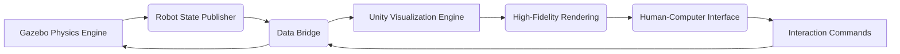

# Chapter 3: Sensor Simulation and Unity Integration for High-Fidelity Rendering

## Learning Objectives

By the end of this chapter, you will be able to:
- Implement various sensor types in Gazebo simulation (LiDAR, Depth Cameras, IMUs)
- Configure sensor parameters for realistic humanoid robot perception
- Understand the integration between Gazebo and Unity for enhanced visualization
- Set up high-fidelity rendering pipelines for human-robot interaction
- Apply sensor fusion techniques in simulated environments

## Introduction to Sensor Simulation

Sensor simulation is crucial for developing and testing humanoid robots in virtual environments. It allows developers to:

- Test perception algorithms without physical hardware
- Generate large datasets for AI training
- Validate sensor fusion approaches
- Evaluate human-robot interaction scenarios safely
- Reduce development costs and time

In the context of humanoid robotics, sensor simulation must accurately represent how robots perceive their environment through various modalities.

## LiDAR Sensor Simulation

### 2D LiDAR (Laser Scanner)

2D LiDAR sensors provide distance measurements in a 2D plane and are commonly used for navigation and mapping:

```xml
<!-- In URDF/SDF -->
<gazebo reference="laser_link">
  <sensor name="laser_scan" type="ray">
    <pose>0 0 0 0 0 0</pose>
    <visualize>true</visualize>
    <update_rate>10</update_rate>
    <ray>
      <scan>
        <horizontal>
          <samples>720</samples>
          <resolution>1</resolution>
          <min_angle>-1.570796</min_angle>  <!-- -90 degrees -->
          <max_angle>1.570796</max_angle>   <!-- 90 degrees -->
        </horizontal>
      </scan>
      <range>
        <min>0.1</min>
        <max>30.0</max>
        <resolution>0.01</resolution>
      </range>
    </ray>
    <plugin name="laser_controller" filename="libgazebo_ros_ray_sensor.so">
      <ros>
        <namespace>/laser</namespace>
        <remapping>~/out:=scan</remapping>
      </ros>
      <output_type>sensor_msgs/LaserScan</output_type>
      <frame_name>laser_link</frame_name>
    </plugin>
  </sensor>
</gazebo>
```

### 3D LiDAR (Velodyne-style)

3D LiDAR sensors provide full 3D point cloud data for complex environment mapping:

```xml
<gazebo reference="velodyne_link">
  <sensor name="velodyne_sensor" type="ray">
    <pose>0 0 0 0 0 0</pose>
    <visualize>false</visualize>
    <update_rate>10</update_rate>
    <ray>
      <scan>
        <horizontal>
          <samples>800</samples>
          <resolution>1</resolution>
          <min_angle>-3.14159</min_angle>
          <max_angle>3.14159</max_angle>
        </horizontal>
        <vertical>
          <samples>32</samples>
          <resolution>1</resolution>
          <min_angle>-0.261799</min_angle>  <!-- -15 degrees -->
          <max_angle>0.261799</max_angle>   <!-- 15 degrees -->
        </vertical>
      </scan>
      <range>
        <min>0.2</min>
        <max>100.0</max>
        <resolution>0.01</resolution>
      </range>
    </ray>
    <plugin name="velodyne_controller" filename="libgazebo_ros_velodyne_gpu.so">
      <ros>
        <namespace>/velodyne</namespace>
        <remapping>~/out:=/velodyne_points</remapping>
      </ros>
      <topic_name>/velodyne_points</topic_name>
      <frame_name>velodyne_link</frame_name>
      <min_range>0.9</min_range>
      <max_range>130.0</max_range>
      <gaussian_noise>0.008</gaussian_noise>
    </plugin>
  </sensor>
</gazebo>
```

### LiDAR Configuration for Humanoid Robots

For humanoid robots, LiDAR placement is critical for navigation and obstacle detection:

```xml
<!-- Head-mounted LiDAR for environment mapping -->
<joint name="head_laser_joint" type="fixed">
  <parent link="head"/>
  <child link="head_laser_link"/>
  <origin xyz="0.05 0 0.05" rpy="0 0 0"/>
</joint>

<link name="head_laser_link">
  <inertial>
    <mass value="0.1"/>
    <origin xyz="0 0 0"/>
    <inertia ixx="0.0001" ixy="0" ixz="0" iyy="0.0001" iyz="0" izz="0.0001"/>
  </inertial>
</link>

<!-- Chest-mounted LiDAR for navigation -->
<joint name="chest_laser_joint" type="fixed">
  <parent link="torso"/>
  <child link="chest_laser_link"/>
  <origin xyz="0.1 0 0.1" rpy="0 0 0"/>
</joint>

<link name="chest_laser_link">
  <inertial>
    <mass value="0.1"/>
    <origin xyz="0 0 0"/>
    <inertia ixx="0.0001" ixy="0" ixz="0" iyy="0.0001" iyz="0" izz="0.0001"/>
  </inertial>
</link>
```

## Depth Camera Simulation

Depth cameras provide both visual and depth information, essential for humanoid perception:

### RGB-D Camera Configuration

```xml
<gazebo reference="camera_link">
  <sensor name="camera" type="depth">
    <always_on>true</always_on>
    <update_rate>30</update_rate>
    <camera name="head">
      <horizontal_fov>1.047</horizontal_fov>  <!-- 60 degrees -->
      <image>
        <format>R8G8B8</format>
        <width>640</width>
        <height>480</height>
      </image>
      <clip>
        <near>0.1</near>
        <far>10.0</far>
      </clip>
      <noise>
        <type>gaussian</type>
        <mean>0.0</mean>
        <stddev>0.007</stddev>
      </noise>
    </camera>
    <visualize>true</visualize>
    <plugin name="camera_controller" filename="libgazebo_ros_openni_kinect.so">
      <alwaysOn>true</alwaysOn>
      <updateRate>30.0</updateRate>
      <cameraName>camera</cameraName>
      <frameName>camera_optical_frame</frameName>
      <baseline>0.2</baseline>
      <distortion_k1>0.0</distortion_k1>
      <distortion_k2>0.0</distortion_k2>
      <distortion_k3>0.0</distortion_k3>
      <distortion_t1>0.0</distortion_t1>
      <distortion_t2>0.0</distortion_t2>
      <pointCloudCutoff>0.1</pointCloudCutoff>
      <pointCloudCutoffMax>3.0</pointCloudCutoffMax>
      <CxPrime>0.0</CxPrime>
      <Cx>0.0</Cx>
      <Cy>0.0</Cy>
      <focalLength>0.0</focalLength>
      <hackBaseline>0.0</hackBaseline>
      <disableDistortionCorrection>false</disableDistortionCorrection>
      <projection_parameters>
        <px>0.0</px>
        <py>0.0</py>
      </projection_parameters>
      <ros>
        <namespace>/camera</namespace>
        <remapping>rgb/image_raw:=/camera/rgb/image_raw</remapping>
        <remapping>depth/image_raw:=/camera/depth/image_raw</remapping>
        <remapping>depth/points:=/camera/depth/points</remapping>
        <remapping>rgb/camera_info:=/camera/rgb/camera_info</remapping>
      </ros>
    </plugin>
  </sensor>
</gazebo>
```

### Stereo Camera Setup

Stereo cameras provide depth perception through triangulation:

```xml
<!-- Left camera -->
<joint name="left_camera_joint" type="fixed">
  <parent link="head"/>
  <child link="left_camera_frame"/>
  <origin xyz="0.05 0.06 0.05" rpy="0 0 0"/>
</joint>

<link name="left_camera_frame">
  <inertial>
    <mass value="0.01"/>
    <origin xyz="0 0 0"/>
    <inertia ixx="0.000001" ixy="0" ixz="0" iyy="0.000001" iyz="0" izz="0.000001"/>
  </inertial>
</link>

<!-- Right camera -->
<joint name="right_camera_joint" type="fixed">
  <parent link="head"/>
  <child link="right_camera_frame"/>
  <origin xyz="0.05 -0.06 0.05" rpy="0 0 0"/>
</joint>

<link name="right_camera_frame">
  <inertial>
    <mass value="0.01"/>
    <origin xyz="0 0 0"/>
    <inertia ixx="0.000001" ixy="0" ixz="0" iyy="0.000001" iyz="0" izz="0.000001"/>
  </inertial>
</link>

<!-- Configure both cameras with appropriate plugins -->
<gazebo reference="left_camera_frame">
  <sensor name="left_camera" type="camera">
    <!-- Camera configuration -->
  </sensor>
</gazebo>

<gazebo reference="right_camera_frame">
  <sensor name="right_camera" type="camera">
    <!-- Camera configuration -->
  </sensor>
</gazebo>
```

### Depth Camera for Humanoid Applications

```xml
<!-- Face detection camera -->
<joint name="face_camera_joint" type="fixed">
  <parent link="head"/>
  <child link="face_camera_link"/>
  <origin xyz="0.08 0 0.02" rpy="0 0 0"/>  <!-- Positioned at face level -->
</joint>

<link name="face_camera_link">
  <inertial>
    <mass value="0.01"/>
    <origin xyz="0 0 0"/>
    <inertia ixx="0.000001" ixy="0" ixz="0" iyy="0.000001" iyz="0" izz="0.000001"/>
  </inertial>
</link>

<!-- Navigation camera -->
<joint name="nav_camera_joint" type="fixed">
  <parent link="torso"/>
  <child link="nav_camera_link"/>
  <origin xyz="0.15 0 0.1" rpy="0 -0.1 0"/>  <!-- Slightly downward facing -->
</joint>

<link name="nav_camera_link">
  <inertial>
    <mass value="0.01"/>
    <origin xyz="0 0 0"/>
    <inertia ixx="0.000001" ixy="0" ixz="0" iyy="0.000001" iyz="0" izz="0.000001"/>
  </inertial>
</link>
```

## IMU Sensor Simulation

IMU (Inertial Measurement Unit) sensors provide crucial information about robot orientation and acceleration:

### IMU Configuration

```xml
<!-- IMU in the torso for balance estimation -->
<gazebo reference="torso">
  <sensor name="torso_imu" type="imu">
    <always_on>true</always_on>
    <update_rate>100</update_rate>
    <visualize>false</visualize>
    <imu>
      <angular_velocity>
        <x>
          <noise type="gaussian">
            <mean>0.0</mean>
            <stddev>0.0017</stddev>  <!-- ~0.1 deg/s -->
          </noise>
        </x>
        <y>
          <noise type="gaussian">
            <mean>0.0</mean>
            <stddev>0.0017</stddev>
          </noise>
        </y>
        <z>
          <noise type="gaussian">
            <mean>0.0</mean>
            <stddev>0.0017</stddev>
          </noise>
        </z>
      </angular_velocity>
      <linear_acceleration>
        <x>
          <noise type="gaussian">
            <mean>0.0</mean>
            <stddev>0.017</stddev>  <!-- ~0.017 m/s² -->
          </noise>
        </x>
        <y>
          <noise type="gaussian">
            <mean>0.0</mean>
            <stddev>0.017</stddev>
          </noise>
        </y>
        <z>
          <noise type="gaussian">
            <mean>0.0</mean>
            <stddev>0.017</stddev>
          </noise>
        </z>
      </linear_acceleration>
    </imu>
    <plugin name="imu_controller" filename="libgazebo_ros_imu.so">
      <ros>
        <namespace>/imu</namespace>
        <remapping>~/out:=data</remapping>
      </ros>
      <frame_name>torso</frame_name>
      <body_name>torso</body_name>
      <update_rate>100</update_rate>
      <gaussian_noise>0.017</gaussian_noise>
    </plugin>
  </sensor>
</gazebo>
```

### Multiple IMU Placement for Humanoid Balance

```xml
<!-- Head IMU for orientation tracking -->
<joint name="head_imu_joint" type="fixed">
  <parent link="head"/>
  <child link="head_imu_link"/>
  <origin xyz="0 0 0.05" rpy="0 0 0"/>
</joint>

<link name="head_imu_link">
  <inertial>
    <mass value="0.001"/>
    <origin xyz="0 0 0"/>
    <inertia ixx="0.000000001" ixy="0" ixz="0" iyy="0.000000001" iyz="0" izz="0.000000001"/>
  </inertial>
</link>

<!-- Foot IMUs for contact detection -->
<joint name="left_foot_imu_joint" type="fixed">
  <parent link="left_foot"/>
  <child link="left_foot_imu_link"/>
  <origin xyz="0 0 0" rpy="0 0 0"/>
</joint>

<link name="left_foot_imu_link">
  <inertial>
    <mass value="0.001"/>
    <origin xyz="0 0 0"/>
    <inertia ixx="0.000000001" ixy="0" ixz="0" iyy="0.000000001" iyz="0" izz="0.000000001"/>
  </inertial>
</link>
```

## Advanced Sensor Simulation

### Force/Torque Sensors

Force/torque sensors are crucial for humanoid manipulation and balance:

```xml
<!-- Force/Torque sensor at ankle for balance control -->
<gazebo reference="left_ankle">
  <sensor name="left_ankle_ft" type="force_torque">
    <always_on>true</always_on>
    <update_rate>100</update_rate>
    <force_torque>
      <frame>child</frame>
      <measure_direction>child_to_parent</measure_direction>
    </force_torque>
    <plugin name="ft_sensor_plugin" filename="libgazebo_ros_ft_sensor.so">
      <ros>
        <namespace>/ft_sensor</namespace>
        <remapping>~/wrench:=left_ankle_wrench</remapping>
      </ros>
      <frame_name>left_ankle</frame_name>
      <topic_name>left_ankle_wrench</topic_name>
    </plugin>
  </sensor>
</gazebo>
```

### GPS Simulation

For outdoor humanoid applications:

```xml
<gazebo reference="base_link">
  <sensor name="gps_sensor" type="gps">
    <always_on>true</always_on>
    <update_rate>1</update_rate>
    <visualize>false</visualize>
    <plugin name="gps_plugin" filename="libgazebo_ros_gps.so">
      <ros>
        <namespace>/gps</namespace>
        <remapping>~/out:=fix</remapping>
      </ros>
      <frame_name>base_link</frame_name>
      <update_rate>1.0</update_rate>
      <gaussian_noise>0.1</gaussian_noise>
    </plugin>
  </sensor>
</gazebo>
```

## Unity Integration for High-Fidelity Rendering

### Unity as a Visualization Tool

While Gazebo provides accurate physics simulation, Unity excels in high-fidelity rendering and human-robot interaction. The two can be integrated for the best of both worlds:

1. **Physics Simulation**: Gazebo handles accurate physics
2. **Visual Rendering**: Unity provides photorealistic visualization
3. **Human Interaction**: Unity enables intuitive human-robot interaction interfaces

### Gazebo-Unity Bridge Architecture



### Setting Up the Bridge

#### 1. ROS 2 Bridge Package

Use the `ros_gz_bridge` package to connect ROS 2, Gazebo, and external visualization tools:

```bash
# Install the bridge package
sudo apt install ros-humble-ros-gz-bridge

# Launch the bridge
ros2 run ros_gz_bridge parameter_bridge
```

#### 2. Unity ROS TCP Connector

In Unity, use the Unity ROS TCP connector to receive simulation data:

```csharp
// Unity C# script for receiving robot state
using System.Collections;
using System.Collections.Generic;
using UnityEngine;
using ROS2;
using std_msgs.msg;

public class RobotStateReceiver : MonoBehaviour
{
    private ROS2UnityComponent ros2Unity;
    private ISubscription<JointState> jointStateSub;

    void Start()
    {
        ros2Unity = GetComponent<ROS2UnityComponent>();
        ros2Unity.Init();
        ros2Unity.CreateNode("unity_robot_visualizer");

        jointStateSub = ros2Unity.node.CreateSubscription<JointState>
            ("/joint_states", JointStateCallback);
    }

    void JointStateCallback(JointState jointState)
    {
        // Update Unity robot model based on received joint states
        UpdateRobotModel(jointState);
    }

    void UpdateRobotModel(JointState jointState)
    {
        for (int i = 0; i < jointState.name.Count; i++)
        {
            string jointName = jointState.name[i];
            float jointPosition = jointState.position[i];

            Transform jointTransform = FindJointTransform(jointName);
            if (jointTransform != null)
            {
                // Apply rotation based on joint position
                jointTransform.localRotation =
                    Quaternion.AngleAxis(jointPosition * Mathf.Rad2Deg, Vector3.right);
            }
        }
    }

    Transform FindJointTransform(string jointName)
    {
        // Find the corresponding joint in Unity hierarchy
        Transform[] allChildren = GetComponentsInChildren<Transform>();
        foreach (Transform child in allChildren)
        {
            if (child.name == jointName)
                return child;
        }
        return null;
    }
}
```

### Unity Asset Setup for Humanoid Robots

#### 1. Creating Humanoid Robot Models in Unity

```csharp
// Example script for humanoid robot in Unity
using UnityEngine;

public class HumanoidRobotController : MonoBehaviour
{
    [Header("Joint Configuration")]
    public Transform head;
    public Transform leftArm;
    public Transform rightArm;
    public Transform leftLeg;
    public Transform rightLeg;

    [Header("Sensor Visualization")]
    public GameObject[] lidarPoints;
    public GameObject cameraFrustum;

    void Update()
    {
        // Update sensor visualizations based on simulation data
        UpdateLidarVisualization();
        UpdateCameraVisualization();
    }

    void UpdateLidarVisualization()
    {
        // Visualize LiDAR points received from simulation
        // This would typically be updated from ROS 2 messages
    }

    void UpdateCameraVisualization()
    {
        // Show camera frustum for depth camera visualization
        // Update based on camera data from simulation
    }
}
```

#### 2. High-Fidelity Rendering Materials

```csharp
// Shader for realistic robot materials in Unity
Shader "Custom/RobotMaterial"
{
    Properties
    {
        _Color ("Color", Color) = (0.8, 0.8, 0.8, 1)
        _Metallic ("Metallic", Range(0, 1)) = 0.5
        _Smoothness ("Smoothness", Range(0, 1)) = 0.5
        _MainTex ("Albedo", 2D) = "white" {}
    }
    SubShader
    {
        Tags { "RenderType"="Opaque" }
        LOD 200

        CGPROGRAM
        #pragma surface surf Standard fullforwardshadows
        #pragma target 3.0

        struct Input
        {
            float2 uv_MainTex;
        };

        sampler2D _MainTex;
        fixed4 _Color;
        half _Metallic;
        half _Smoothness;

        void surf (Input IN, inout SurfaceOutputStandard o)
        {
            fixed4 c = tex2D(_MainTex, IN.uv_MainTex) * _Color;
            o.Albedo = c.rgb;
            o.Metallic = _Metallic;
            o.Smoothness = _Smoothness;
            o.Alpha = c.a;
        }
        ENDCG
    }
}
```

## Sensor Fusion in Simulation

### Combining Multiple Sensor Inputs

```python
import rclpy
from rclpy.node import Node
from sensor_msgs.msg import LaserScan, Image, Imu, PointCloud2
from geometry_msgs.msg import PoseWithCovarianceStamped
from nav_msgs.msg import Odometry
import numpy as np
from scipy.spatial.transform import Rotation as R

class SensorFusionNode(Node):
    def __init__(self):
        super().__init__('sensor_fusion_node')

        # Subscriptions for different sensors
        self.lidar_sub = self.create_subscription(
            LaserScan, '/laser/scan', self.lidar_callback, 10)
        self.imu_sub = self.create_subscription(
            Imu, '/imu/data', self.imu_callback, 10)
        self.odom_sub = self.create_subscription(
            Odometry, '/odom', self.odom_callback, 10)
        self.camera_sub = self.create_subscription(
            Image, '/camera/rgb/image_raw', self.camera_callback, 10)

        # Publisher for fused state
        self.fused_state_pub = self.create_publisher(
            PoseWithCovarianceStamped, '/fused_pose', 10)

        # Initialize state variables
        self.robot_pose = np.zeros(6)  # x, y, z, roll, pitch, yaw
        self.robot_velocity = np.zeros(6)  # linear and angular velocities

    def lidar_callback(self, msg):
        # Process LiDAR data for environment mapping
        ranges = np.array(msg.ranges)
        # Implement obstacle detection and mapping
        self.process_lidar_data(ranges, msg.angle_min, msg.angle_increment)

    def imu_callback(self, msg):
        # Process IMU data for orientation and acceleration
        orientation = [msg.orientation.x, msg.orientation.y,
                      msg.orientation.z, msg.orientation.w]
        angular_velocity = [msg.angular_velocity.x, msg.angular_velocity.y,
                           msg.angular_velocity.z]
        linear_acceleration = [msg.linear_acceleration.x,
                              msg.linear_acceleration.y,
                              msg.linear_acceleration.z]

        # Update pose estimate using IMU integration
        self.update_pose_from_imu(orientation, angular_velocity, linear_acceleration)

    def odom_callback(self, msg):
        # Process odometry data
        position = [msg.pose.pose.position.x, msg.pose.pose.position.y,
                   msg.pose.pose.position.z]
        orientation = [msg.pose.pose.orientation.x, msg.pose.pose.orientation.y,
                      msg.pose.pose.orientation.z, msg.pose.pose.orientation.w]

        # Update pose estimate from odometry
        self.update_pose_from_odom(position, orientation)

    def camera_callback(self, msg):
        # Process camera data for visual features
        # This could include face detection, object recognition, etc.
        self.process_camera_data(msg)

    def sensor_fusion_update(self):
        # Implement Kalman filter or other fusion algorithm
        # Combine all sensor inputs to get optimal state estimate
        pass

    def publish_fused_state(self):
        # Publish the fused state estimate
        fused_pose_msg = PoseWithCovarianceStamped()
        # Fill in the message with fused state data
        self.fused_state_pub.publish(fused_pose_msg)

def main(args=None):
    rclpy.init(args=args)
    sensor_fusion_node = SensorFusionNode()

    try:
        rclpy.spin(sensor_fusion_node)
    except KeyboardInterrupt:
        pass
    finally:
        sensor_fusion_node.destroy_node()
        rclpy.shutdown()

if __name__ == '__main__':
    main()
```

### Extended Kalman Filter for Sensor Fusion

```python
import numpy as np
from scipy.linalg import block_diag

class ExtendedKalmanFilter:
    def __init__(self):
        # State vector: [x, y, z, roll, pitch, yaw, vx, vy, vz, wx, wy, wz]
        self.state_dim = 12
        self.state = np.zeros(self.state_dim)

        # Covariance matrix
        self.covariance = np.eye(self.state_dim) * 0.1

        # Process noise
        self.process_noise = np.eye(self.state_dim) * 0.01

    def predict(self, dt):
        """Prediction step of EKF"""
        # State transition model (simplified)
        F = self.compute_jacobian_F(dt)

        # Predict state
        self.state = self.state_transition(self.state, dt)

        # Predict covariance
        self.covariance = F @ self.covariance @ F.T + self.process_noise

    def update_lidar(self, lidar_data):
        """Update from LiDAR measurements"""
        # Measurement model for LiDAR
        H = self.compute_jacobian_H_lidar()
        z = self.extract_lidar_features(lidar_data)

        # Innovation
        innovation = z - self.lidar_measurement_model(self.state)

        # Innovation covariance
        S = H @ self.covariance @ H.T + self.lidar_noise

        # Kalman gain
        K = self.covariance @ H.T @ np.linalg.inv(S)

        # Update state and covariance
        self.state = self.state + K @ innovation
        self.covariance = (np.eye(self.state_dim) - K @ H) @ self.covariance

    def update_imu(self, imu_data):
        """Update from IMU measurements"""
        # Similar process for IMU data
        pass

    def update_camera(self, camera_data):
        """Update from camera measurements"""
        # Similar process for camera data
        pass

    def state_transition(self, state, dt):
        """Nonlinear state transition model"""
        # Implement the dynamics model
        return state
```

## Human-Robot Interaction in Unity

### Creating Interactive Interfaces

```csharp
// Unity script for human-robot interaction
using UnityEngine;
using UnityEngine.UI;
using TMPro;

public class HumanRobotInterface : MonoBehaviour
{
    [Header("UI Elements")]
    public Slider robotSpeedSlider;
    public Button walkButton;
    public Button stopButton;
    public Button gestureButton;
    public TextMeshProUGUI statusText;

    [Header("Robot Control")]
    public HumanoidRobotController robotController;

    void Start()
    {
        SetupUI();
    }

    void SetupUI()
    {
        robotSpeedSlider.onValueChanged.AddListener(OnSpeedChanged);
        walkButton.onClick.AddListener(OnWalkClicked);
        stopButton.onClick.AddListener(OnStopClicked);
        gestureButton.onClick.AddListener(OnGestureClicked);
    }

    void OnSpeedChanged(float speed)
    {
        // Send speed command to robot through ROS 2
        robotController.SetSpeed(speed);
        statusText.text = $"Speed: {speed:F2} m/s";
    }

    void OnWalkClicked()
    {
        // Send walk command to robot
        robotController.StartWalking();
        statusText.text = "Walking...";
    }

    void OnStopClicked()
    {
        // Send stop command to robot
        robotController.Stop();
        statusText.text = "Stopped";
    }

    void OnGestureClicked()
    {
        // Send gesture command to robot
        robotController.PerformGesture();
        statusText.text = "Performing gesture...";
    }
}
```

### Virtual Reality Integration

```csharp
// VR interaction for humanoid robot control
using UnityEngine;
using UnityEngine.XR;

public class VRHumanoidControl : MonoBehaviour
{
    [Header("VR Controllers")]
    public Transform leftController;
    public Transform rightController;

    [Header("Robot Control")]
    public HumanoidRobotController robot;

    void Update()
    {
        HandleVRInput();
    }

    void HandleVRInput()
    {
        // Get VR controller inputs
        if (leftController != null)
        {
            // Use left controller for navigation commands
            Vector3 leftPosition = leftController.position;
            Quaternion leftRotation = leftController.rotation;

            // Send navigation commands based on controller position/orientation
            SendNavigationCommand(leftPosition, leftRotation);
        }

        if (rightController != null)
        {
            // Use right controller for manipulation commands
            Vector3 rightPosition = rightController.position;
            Quaternion rightRotation = rightController.rotation;

            // Send manipulation commands
            SendManipulationCommand(rightPosition, rightRotation);
        }
    }

    void SendNavigationCommand(Vector3 position, Quaternion rotation)
    {
        // Convert VR input to robot navigation commands
        // This would typically send ROS 2 messages
    }

    void SendManipulationCommand(Vector3 position, Quaternion rotation)
    {
        // Convert VR input to robot manipulation commands
    }
}
```

## Performance Optimization

### Sensor Simulation Optimization

```xml
<!-- Optimize sensor update rates based on application needs -->
<!-- For navigation: 10-20 Hz LiDAR is often sufficient -->
<gazebo reference="navigation_lidar">
  <sensor name="nav_lidar" type="ray">
    <update_rate>15</update_rate>  <!-- Lower update rate for better performance -->
    <!-- ... other configurations ... -->
  </sensor>
</gazebo>

<!-- For precise manipulation: Higher update rate IMU -->
<gazebo reference="balance_imu">
  <sensor name="balance_imu" type="imu">
    <update_rate>200</update_rate>  <!-- Higher update rate for balance control -->
    <!-- ... other configurations ... -->
  </sensor>
</gazebo>
```

### Unity Rendering Optimization

```csharp
// LOD (Level of Detail) system for robot models
using UnityEngine;

public class RobotLODSystem : MonoBehaviour
{
    [Header("LOD Configuration")]
    public Transform[] lodLevels;
    public float[] lodDistances;

    [Header("Performance Settings")]
    public bool enableLOD = true;
    public float lodUpdateInterval = 0.5f;

    private float lastLODUpdate;
    private Transform cameraTransform;

    void Start()
    {
        // Find main camera
        cameraTransform = Camera.main.transform;
    }

    void Update()
    {
        if (enableLOD && Time.time - lastLODUpdate > lodUpdateInterval)
        {
            UpdateLOD();
            lastLODUpdate = Time.time;
        }
    }

    void UpdateLOD()
    {
        if (cameraTransform != null)
        {
            float distance = Vector3.Distance(transform.position, cameraTransform.position);

            for (int i = 0; i < lodLevels.Length; i++)
            {
                if (distance < lodDistances[i])
                {
                    // Activate this LOD level
                    ActivateLOD(i);
                    break;
                }
            }
        }
    }

    void ActivateLOD(int level)
    {
        for (int i = 0; i < lodLevels.Length; i++)
        {
            lodLevels[i].gameObject.SetActive(i == level);
        }
    }
}
```

## Troubleshooting Common Issues

### Sensor Data Quality Issues

1. **Noisy Sensor Data**:
   - Check noise parameters in sensor configuration
   - Verify update rates are appropriate
   - Ensure proper coordinate frame alignment

2. **Delayed Sensor Updates**:
   - Increase update rates if needed
   - Check network bandwidth for remote visualization
   - Optimize ROS 2 QoS settings

3. **Incorrect Sensor Readings**:
   - Verify sensor placement in URDF
   - Check coordinate frame conventions
   - Ensure proper calibration parameters

### Unity Integration Issues

1. **Synchronization Problems**:
   - Use appropriate time synchronization
   - Implement interpolation for smooth visualization
   - Check message rates between systems

2. **Performance Issues**:
   - Reduce Unity rendering quality during development
   - Use Level of Detail (LOD) systems
   - Optimize sensor update rates

## Summary

This chapter covered the comprehensive setup of sensor simulation for humanoid robots:

- LiDAR, depth camera, and IMU configurations in Gazebo
- Proper sensor placement and parameter tuning for humanoid applications
- Unity integration for high-fidelity rendering and human-robot interaction
- Sensor fusion techniques for combining multiple sensor inputs
- Performance optimization strategies for both simulation and visualization

The integration of accurate sensor simulation with high-fidelity visualization in Unity provides a powerful platform for developing and testing humanoid robots in complex scenarios. This combination enables realistic testing of perception algorithms, human-robot interaction interfaces, and control systems before deployment on physical hardware.