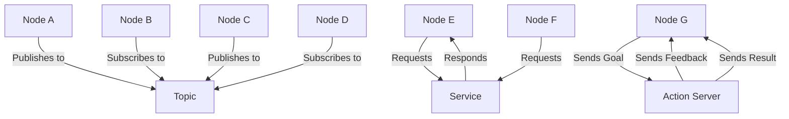
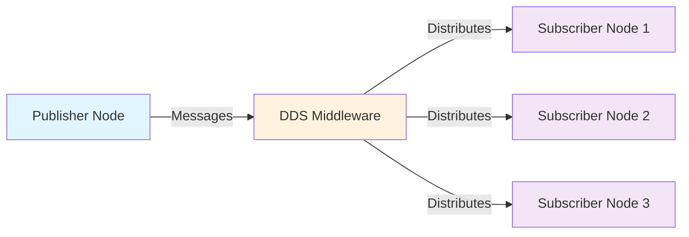
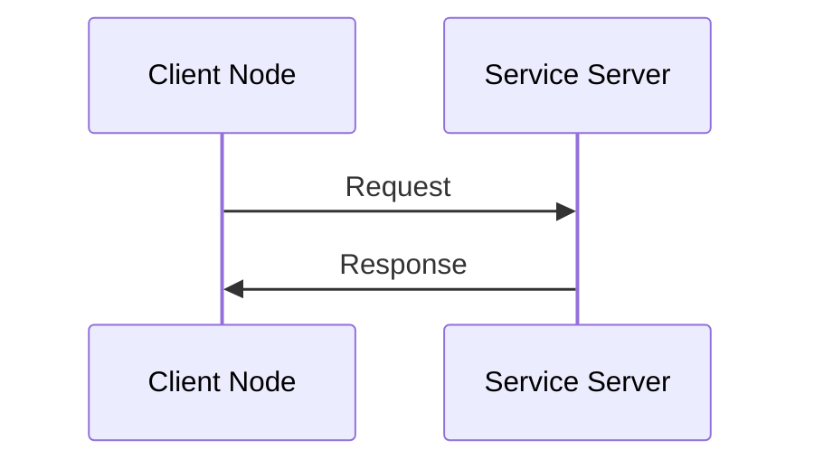
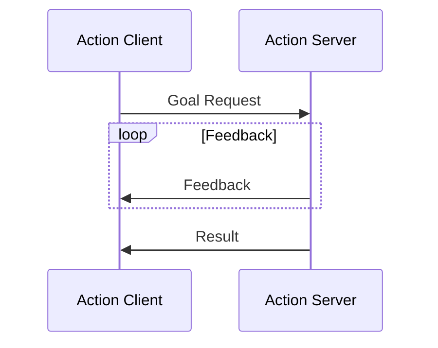

# Chapter 1: ROS 2 Architecture Fundamentals

## Learning Objectives

By the end of this chapter, you will be able to:
- Explain the fundamental concepts of ROS 2 architecture
- Identify and differentiate between nodes, topics, services, and actions
- Understand how these components interact in a distributed system
- Visualize the communication patterns in ROS 2

## Introduction to ROS 2 Architecture

ROS 2 (Robot Operating System 2) is a flexible framework for writing robot software. It is a collection of tools, libraries, and conventions that aim to simplify the task of creating complex and robust robot behavior across a wide variety of robot platforms. The architecture of ROS 2 is designed to support distributed computing, real-time operations, and embedded systems.

Unlike its predecessor ROS 1, ROS 2 is built on DDS (Data Distribution Service), which provides a middleware that enables scalable, real-time, reliable, and interoperable data exchanges between devices and applications.

## Nodes

### What is a Node?

A **node** is a process that performs computation. Nodes are the fundamental building blocks of ROS 2 applications. Each node is designed to perform a specific task, such as sensor data processing, motion planning, or control algorithms.

### Key Characteristics of Nodes

- **Modularity**: Each node performs a specific function
- **Communication**: Nodes communicate with each other through topics, services, or actions
- **Process**: Each node runs as a separate process
- **Lifecycle**: Nodes can have different lifecycle states (unconfigured, inactive, active, finalized)

### Node Implementation Example

```python
import rclpy
from rclpy.node import Node

class MinimalPublisher(Node):

    def __init__(self):
        super().__init__('minimal_publisher')
        self.publisher_ = self.create_publisher(String, 'topic', 10)
        timer_period = 0.5  # seconds
        self.timer = self.create_timer(timer_period, self.timer_callback)
        self.i = 0

    def timer_callback(self):
        msg = String()
        msg.data = 'Hello World: %d' % self.i
        self.publisher_.publish(msg)
        self.get_logger().info('Publishing: "%s"' % msg.data)
        self.i += 1
```

## Topics

### What is a Topic?

A **topic** is an asynchronous, unidirectional, many-to-many communication mechanism in ROS 2. Topics enable data exchange between nodes using a publish-subscribe pattern.

### Key Characteristics of Topics

- **Publish-Subscribe Pattern**: Publishers send messages to a topic, subscribers receive messages from the topic
- **Asynchronous**: Publishers and subscribers don't need to be synchronized
- **Many-to-Many**: Multiple publishers can publish to the same topic, multiple subscribers can subscribe to the same topic
- **Message Types**: Each topic has a specific message type that defines the structure of the data

### Topic Communication Flow

1. A node creates a publisher for a specific topic
2. Another node creates a subscriber for the same topic
3. The publisher sends messages to the topic
4. The DDS middleware delivers messages to all subscribers of that topic

### Topic Example

```python
# Publisher example
publisher = self.create_publisher(String, 'chatter', 10)

# Subscriber example
subscription = self.create_subscription(
    String,
    'chatter',
    self.listener_callback,
    10)

def listener_callback(self, msg):
    self.get_logger().info('I heard: "%s"' % msg.data)
```

## Services

### What is a Service?

A **service** is a synchronous, bidirectional, request-response communication mechanism in ROS 2. Services enable a client-server communication pattern where a client sends a request and waits for a response.

### Key Characteristics of Services

- **Request-Response Pattern**: Client sends a request, server responds
- **Synchronous**: Client waits for the response before continuing
- **One-to-One**: Typically one client communicates with one server
- **Service Types**: Each service has a specific service type that defines the request and response structure

### Service Communication Flow

1. A node creates a service server for a specific service type
2. Another node creates a client for the same service type
3. The client sends a request to the service
4. The server processes the request and sends a response back to the client

### Service Example

```python
# Service server example
self.srv = self.create_service(AddTwoInts, 'add_two_ints', self.add_two_ints_callback)

def add_two_ints_callback(self, request, response):
    response.sum = request.a + request.b
    self.get_logger().info('Incoming request\na: %d b: %d' % (request.a, request.b))
    return response

# Service client example
self.cli = self.create_client(AddTwoInts, 'add_two_ints')
```

## Actions

### What is an Action?

An **action** is a communication pattern in ROS 2 that extends the service pattern to support long-running tasks with feedback and goal management. Actions are used for tasks that take a significant amount of time to complete.

### Key Characteristics of Actions

- **Long-Running Tasks**: Designed for operations that take time to complete
- **Goal-Feeback-Result Pattern**: Supports goal setting, ongoing feedback, and final result
- **Cancelation**: Clients can cancel ongoing goals
- **Preemption**: New goals can preempt existing ones

### Action Communication Flow

1. A client sends a goal to an action server
2. The server may send feedback about the goal's progress
3. The server sends the final result when the goal is completed
4. The client can cancel the goal or send a new goal to preempt the current one

### Action Example

```python
# Action server example
from rclpy.action import ActionServer
from example_interfaces.action import Fibonacci

class FibonacciActionServer(Node):

    def __init__(self):
        super().__init__('fibonacci_action_server')
        self._action_server = ActionServer(
            self,
            Fibonacci,
            'fibonacci',
            self.execute_callback)

    def execute_callback(self, goal_handle):
        self.get_logger().info('Executing goal...')

        feedback_msg = Fibonacci.Feedback()
        feedback_msg.sequence = [0, 1]

        for i in range(1, goal_handle.request.order):
            if goal_handle.is_cancel_requested:
                goal_handle.canceled()
                self.get_logger().info('Goal canceled')
                return Fibonacci.Result()

            feedback_msg.sequence.append(
                feedback_msg.sequence[i] + feedback_msg.sequence[i-1])

            goal_handle.publish_feedback(feedback_msg)

        goal_handle.succeed()
        result = Fibonacci.Result()
        result.sequence = feedback_msg.sequence
        return result
```

## Comparison of Communication Patterns

| Feature | Topics | Services | Actions |
|---------|--------|----------|---------|
| Pattern | Publish-Subscribe | Request-Response | Goal-Feedback-Result |
| Synchronization | Asynchronous | Synchronous | Asynchronous with feedback |
| Duration | Continuous | Short-term | Long-term |
| Communication | Many-to-Many | One-to-One | One-to-One |
| Cancelation | No | No | Yes |
| Feedback | No | No | Yes |

## Communication Architecture Diagram



## Detailed Communication Patterns

### Topic Communication Pattern



### Service Communication Pattern



### Action Communication Pattern



## Code Examples and Implementation Details

### Complete Publisher Node Example

```python
import rclpy
from rclpy.node import Node
from std_msgs.msg import String


class MinimalPublisher(Node):

    def __init__(self):
        super().__init__('minimal_publisher')
        self.publisher_ = self.create_publisher(String, 'topic', 10)
        timer_period = 0.5  # seconds
        self.timer = self.create_timer(timer_period, self.timer_callback)
        self.i = 0

    def timer_callback(self):
        msg = String()
        msg.data = 'Hello World: %d' % self.i
        self.publisher_.publish(msg)
        self.get_logger().info('Publishing: "%s"' % msg.data)
        self.i += 1


def main(args=None):
    rclpy.init(args=args)

    minimal_publisher = MinimalPublisher()

    rclpy.spin(minimal_publisher)

    # Destroy the node explicitly
    minimal_publisher.destroy_node()
    rclpy.shutdown()


if __name__ == '__main__':
    main()
```

### Complete Subscriber Node Example

```python
import rclpy
from rclpy.node import Node
from std_msgs.msg import String


class MinimalSubscriber(Node):

    def __init__(self):
        super().__init__('minimal_subscriber')
        self.subscription = self.create_subscription(
            String,
            'topic',
            self.listener_callback,
            10)
        self.subscription  # prevent unused variable warning

    def listener_callback(self, msg):
        self.get_logger().info('I heard: "%s"' % msg.data)


def main(args=None):
    rclpy.init(args=args)

    minimal_subscriber = MinimalSubscriber()

    rclpy.spin(minimal_subscriber)

    # Destroy the node explicitly
    minimal_subscriber.destroy_node()
    rclpy.shutdown()


if __name__ == '__main__':
    main()
```

### Service Server Example

```python
from add_two_ints_srv.srv import AddTwoInts
import rclpy
from rclpy.node import Node


class MinimalService(Node):

    def __init__(self):
        super().__init__('minimal_service')
        self.srv = self.create_service(AddTwoInts, 'add_two_ints', self.add_two_ints_callback)

    def add_two_ints_callback(self, request, response):
        response.sum = request.a + request.b
        self.get_logger().info('Incoming request\na: %d b: %d' % (request.a, request.b))

        return response


def main(args=None):
    rclpy.init(args=args)

    minimal_service = MinimalService()

    rclpy.spin(minimal_service)

    rclpy.shutdown()


if __name__ == '__main__':
    main()
```

### Service Client Example

```python
from add_two_ints_srv.srv import AddTwoInts
import rclpy
from rclpy.node import Node


class MinimalClientAsync(Node):

    def __init__(self):
        super().__init__('minimal_client_async')
        self.cli = self.create_client(AddTwoInts, 'add_two_ints')
        while not self.cli.wait_for_service(timeout_sec=1.0):
            self.get_logger().info('service not available, waiting again...')
        self.req = AddTwoInts.Request()

    def send_request(self):
        self.req.a = 41
        self.req.b = 1
        self.future = self.cli.call_async(self.req)
        rclpy.spin_until_future_complete(self, self.future)
        return self.future.result()


def main():
    rclpy.init()

    minimal_client = MinimalClientAsync()
    response = minimal_client.send_request()
    minimal_client.get_logger().info(
        'Result of add_two_ints: for %d + %d = %d' %
        (minimal_client.req.a, minimal_client.req.b, response.sum))

    minimal_client.destroy_node()
    rclpy.shutdown()


if __name__ == '__main__':
    main()
```

## Architecture Component Summary

### Node Characteristics

| Aspect | Details |
|--------|---------|
| Purpose | Execute computation and provide functionality |
| Communication | Interacts via topics, services, actions |
| Lifecycle | Unconfigured → Inactive → Active → Finalized |
| Implementation | Separate processes in the system |
| Best Practices | Single responsibility, clear interfaces |

### Topic Communication Parameters

| Parameter | Description | Typical Values |
|-----------|-------------|----------------|
| QoS History | Number of messages to store | KEEP_LAST (1-10), KEEP_ALL |
| QoS Depth | Size of the history queue | 1-1000 (depending on use case) |
| QoS Reliability | Delivery guarantee | RELIABLE, BEST_EFFORT |
| QoS Durability | Availability for late-joining nodes | VOLATILE, TRANSIENT_LOCAL |

### Service vs Action Comparison

| Aspect | Services | Actions |
|--------|----------|---------|
| Duration | Short-term operations | Long-term operations |
| Feedback | No ongoing feedback | Continuous feedback |
| Cancelation | No cancelation | Goal cancelation supported |
| Preemption | No preemption | Goal preemption supported |
| Use Cases | Simple queries, commands | Navigation, manipulation, complex tasks |
| Complexity | Lower complexity | Higher complexity |

### DDS Implementation Details

| Feature | ROS 2 Implementation |
|---------|----------------------|
| Middleware | DDS (Data Distribution Service) |
| Communication | Publish-subscribe, request-response |
| Transport | UDP, TCP, shared memory |
| Discovery | Automatic participant discovery |
| Quality of Service | Configurable reliability, durability, etc. |

## Summary

ROS 2 architecture provides a flexible and robust framework for building distributed robotic systems. The three main communication patterns - topics, services, and actions - each serve different purposes:

- **Topics** for continuous, asynchronous data streams
- **Services** for synchronous request-response interactions
- **Actions** for long-running tasks with feedback and cancelation

Understanding these fundamental concepts is crucial for building effective ROS 2 applications and serves as the foundation for more advanced topics in robotics development.