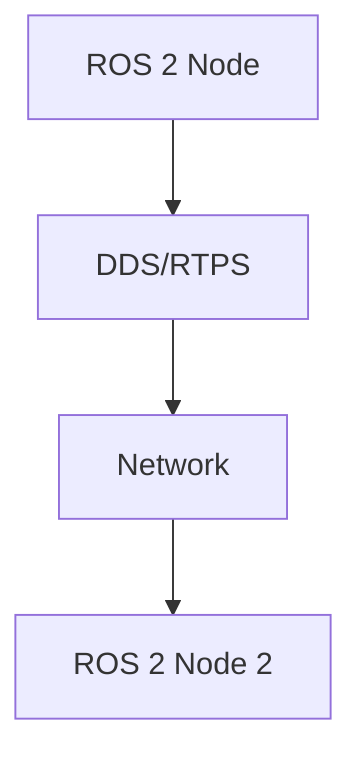

# Quickstart Guide: ROS 2 Textbook Module Development

## Prerequisites
- Node.js (v18 or higher)
- npm or yarn package manager
- Git
- Text editor or IDE

## Setup Instructions

### 1. Clone and Initialize the Repository
```bash
git clone [repository-url]
cd [repository-name]
npm install
```

### 2. Verify Docusaurus Installation
```bash
npm run start
```
This should start a local development server at http://localhost:3000

### 3. Create Module Directory Structure
```bash
mkdir -p docs/module1-ros2
```

### 4. Create the Three Required Chapters

#### Chapter 1: ROS 2 Architecture
```bash
touch docs/module1-ros2/chapter1-architecture.md
```

#### Chapter 2: Python Packages
```bash
touch docs/module1-ros2/chapter2-python-packages.md
```

#### Chapter 3: URDF Modeling
```bash
touch docs/module1-ros2/chapter3-urdf-modeling.md
```

### 5. Update Sidebar Configuration
Add the following to `sidebars.js`:
```javascript
module1ros2: [
  {
    type: 'category',
    label: 'Module 1: The Robotic Nervous System (ROS 2)',
    items: [
      'module1-ros2/chapter1-architecture',
      'module1-ros2/chapter2-python-packages',
      'module1-ros2/chapter3-urdf-modeling',
    ],
  },
],
```

### 6. Add Module to Main Navigation
Update `docusaurus.config.js` to include the new module in the sidebar.

## Content Creation Guidelines

### Adding Code Examples
Use Docusaurus code blocks with language specification:
```markdown
import Tabs from '@theme/Tabs';
import TabItem from '@theme/TabItem';

<Tabs>
<TabItem value="python" label="Python">

```python
import rclpy
from rclpy.node import Node

class MinimalPublisher(Node):
    def __init__(self):
        super().__init__('minimal_publisher')
        self.publisher_ = self.create_publisher(String, 'topic', 10)
```

</TabItem>
<TabItem value="c++" label="C++">

```cpp
#include <rclcpp/rclcpp.hpp>
#include <std_msgs/msg/string.hpp>

class MinimalPublisher : public rclcpp::Node
{
public:
  MinimalPublisher()
  : Node("minimal_publisher")
  {
    publisher_ = this->create_publisher<std_msgs::msg::String>("topic", 10);
  }
```

</TabItem>
</Tabs>
```

### Adding Diagrams
Use Mermaid for architecture diagrams:
```markdown

```

### Adding Tables
```markdown
| Feature | Publisher | Subscriber |
|---------|-----------|------------|
| Topic   | Creates   | Connects   |
| Data Flow | Outgoing | Incoming  |
```

## Building and Deployment

### Local Development
```bash
npm run start
```

### Build Static Site
```bash
npm run build
```

### Deploy to GitHub Pages
```bash
npm run deploy
```

## Next Steps
1. Write content for each chapter following the educational objectives
2. Add appropriate diagrams and code examples
3. Review content for accuracy and educational value
4. Test locally before deployment